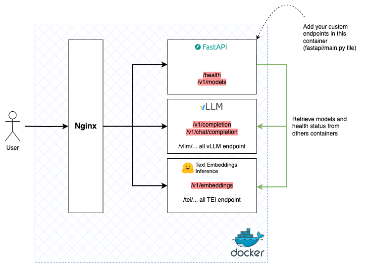

# vLLM + embeddings
### Deploy a full OpenAI API with vLLM that supports all embedding models

  

*🔥 News :* 

- [2024-07-10] add API swagger for test all endpoints
- [2024-07-10] support API_KEY for protect your model API
- [2024-07-10] use directly base url /v1 for Langchain integration
- [2024-07-10] remove max body client for large text
- [2024-07-10] write a tests.py script for test your deployment

*Incoming :*
- Use PyTest for unit test (tests.py file)
---

[vLLM](https://github.com/vllm-project/vllm) is one of the state of the art libraries for deploying a Large Language Model (LLM) and its API with better generation performance. However, vLLM does not currently support all embeddings models for endpoint `/v1/embeddings`, although it can be used to deploy an API according to OpenAI conventions (see this [discussion](https://github.com/vllm-project/vllm/discussions/310)).

This repository makes it easy to add the `/v1/embeddings` endpoint by deploying an embedding model with [HuggingFace Text Embeddings Inference (TEI)](https://github.com/huggingface/text-embeddings-inference) and serves it all on a single port. **The aim of this repository is to have a complete API that's very light, easy to use and maintain !**

**API offer the following OpenAI endpoints:**

* OpenAI endpoints : `/v1`
* vLLM endpoints : `/vllm`
* Text Embeddings Inference endpoints : `/tei`

## How it works ?

<p align="center">
    
</p>

## The swagger

<p align="center">
    
</p>

## Models

Currently, this architecture support almost all LLM and embeddings models. The return of the  `/v1/models` endpoint adds a new "type" key which takes the value "text-generation" or "text-embeddings-inference" depending on the nature of the model (language or embeddings). These values correspond to the label given to models on Huggingface. Example :

```json
{
    "object": "list", 
    "data": [
        {
            "model": < language model >,
            "type": "text-generation",
            ...
        },
        {
            "model": < embeddings model >,
            "type": "text-embeddings-inference",
            ...
        }
    ]
}
```

## Installation

* First, configure a *.env* file or modify the *[.env.example](./.env.example)* file in this repository. For more informations about the configuration, please refer to the [configuration section](#configuration).
  
*  Then, run the containers with Docker compose :

    ```bash
    docker compose --env-file env.example up --detach
    ```

## Configuration

| variable | values |
| --- | --- |
| EMBEDDINGS_HF_REPO_ID | HuggingFace repository ID of the embeddings model. Please refer to [HuggingFace Text Embeddings Inference](https://github.com/huggingface/text-embeddings-inference) documentation to find supported models. | 
| LLM_HF_REPO_ID | HuggingFace repository ID of the LLM model. Please refer to [vLLM](https://github.com/vllm-project/vllm) documentation to find supported models. |
| TEI_ARGS | Arguments for Text Embeddings Inference (format: --arg1 <value> --arg2 <value>). Please refer to [HuggingFace Text Embeddings Inference](https://github.com/huggingface/text-embeddings-inference) documentation for more information. |
| VLLM_ARGS | Arguments for vLLM (format: --arg1 <value> --arg2 <value>). Please refer to [vLLM](https://github.com/vllm-project/vllm) documentation for more information. |
| HF_TOKEN | HuggingFace API token for private model on HuggingFace Hub (optional). |
| API_KEY | API key for protect your model (optional). |

## 🦜 Lanchain integration

You can use the deployed API with Langchain to create embedding vectors for your vector store. For example: 

```python
from langchain_community.embeddings import HuggingFaceHubEmbeddings

embeddings = HuggingFaceHubEmbeddings(model="http://localhost:8080/v1")
```

## 🔦 Tests 

```bash
python tests.py --debug
```
